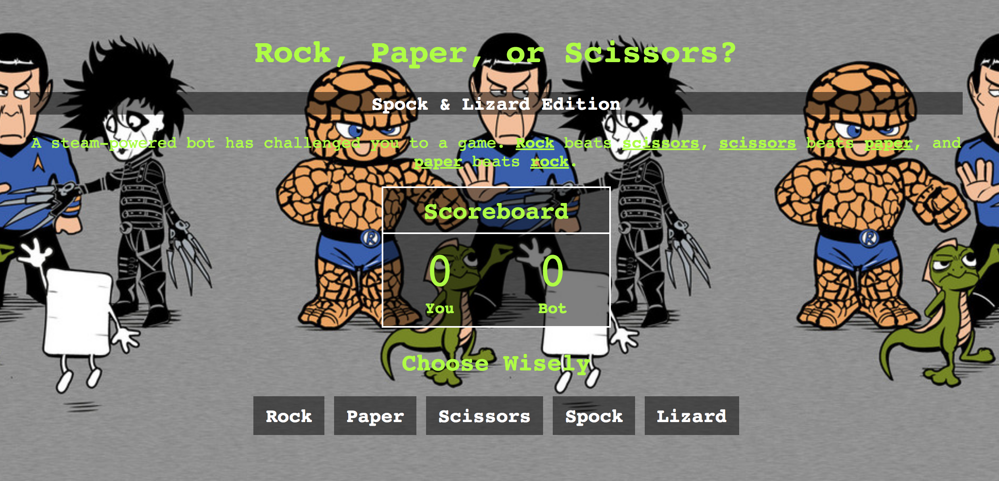

# ROCK PAPER SCISSORS PROJECT
This is a web application that allows users to play the classic game of rock, paper, scissors but with a twist!

## How It's Made:
I used vanilla JavaScript to give to give this game its features. The Math.random method was used to generate and assign a number between 0 & 1 and split the percentage of the that number randomly between all of the arguments. When the user clicks buttons rock, paper, scissor, etc. Once either the user or bot wins the scoreboard is updated to reflect this change.

**Tech used:** HTML, CSS, JavaScript

## Optimizations
I would add a feature to reset the game when someone reaches 10 points.
